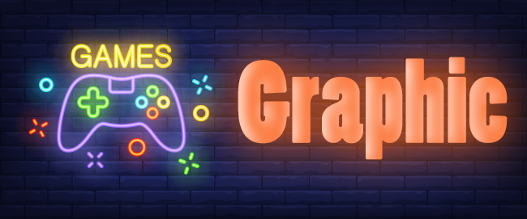

.. class:: main-head

طراحی گرافیک هیوا
########################################################################

.. class:: imagelogo

.. image:: img/my.png
   :width: 200

نمونه_کار_

---------

.. _نمونه کار : ./index-en.html

---------

.. class:: graphics

* خدمات طراحی 
  
======================================================================

.. class:: my-design-table

.. list-table::  لیست خدمات
   :widths: 25 25 50
   :header-rows: 1

   * - لوگو
     - کارت ویزیت
     - پوستر
   * - نوشتاری
     - با لوگوی شخصی
     - نرمال
   * - تصویری
     - ساده
     - حرفه ای

------------

* معرفی طراحی گرافیک  
  
طراحی گرافیک یا شاید طراحی گرافیکی صدایی آشنا برای تمام کسانی است که به خوبی می دانند دنیای امروز اگر زیباتر از گذشته شده است این را مدیون افرادی است که خلاقیت و هنرهای خود را که بسیار ارزشمند است به دنیای امروز منتقل کرده اند و با استعداد و خلاقیتی که در این زمینه دارند باعث شده اند دنیای امروز ما به زیبایی هرچه تمام تر خود برسد و این زیبایی ها در نقش نقش تمام شاهکارهای هنری این افراد خلاق و مبتکر به خوبی دیده می شود

----------

* زیرگروه های طراحی گرافیک

#. هنر های بصری
#. تایپوگرافی
#. صفحه آرایی

--------------

* طراحی گرافیک از گذشته تا امروز 
  
اولین استفاده از ارتباط بصری انتقال ایده ها است. یک نمونه آن نقاشی های درون غارها است که به حدود 15000 سال پیش از میلاد مسیح برمی گردد. مطمئنا آنها به این کار طراحی گرافیک نمی گفتند، ولی ایده اصلی کار یکی است. خطوط تصویری، نمادها و دست خط ها ترکیب شده اند تا یک داستانی را روایت کنند یا پیامی برسانند. امروزه نیز به همین ترتیب است.
 

.. class:: my-info-table

-------------

* اطلاعات تماس 

#. تلفن: 09981590747
#. اینستاگرام: @hiki_house

