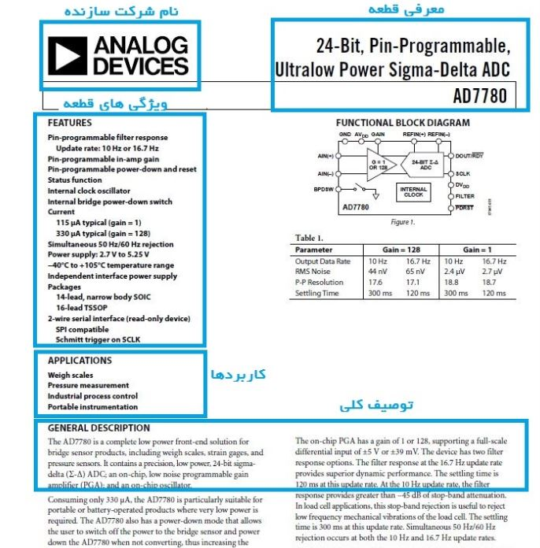

.. class:: main-head

دیتاشیت قطعات الکترونیکی

########################################################################

.. class:: imagelogo

.. image:: img/Ar.jpg
   :width: 200

لینک_بقیه_ی_سایت_ها_

---------

.. _لینک_بقیه_ی_سایت_ها : ./new.html

---------

.. class:: graphics

* نمونه های الکترونیکی
  
======================================================================

.. class:: my-design-table

+------------+---------------+
| CPU        | Type          |
+============+===============+
| Core i3    | Not so fast   |
+------------+---------------+
| Core i5    | Fast          |
+------------+---------------+
| Core i7    | Very fast     |
+------------+---------------+

-----------

* طرز استفاده از دیتا شیت  
  
وقتی یک برگه اطلاعاتی یا دیتاشیت را باز می کنید در اولین صفحه ای که باز می شود مواردی را مشاهده می کنید که تقریبا در همه دیتاشیت ها مشابه یکدیگر است .
شرکت سازنده قطعه مورد نظر : در همه برگه های اطلاعاتی حتما نام و نماد شرکت سازنده قطعه مورد نظر را مشاهده می کنید. در شکل فوق شرکت سازنده ANALOG DEVICES است .که با نماد آورده شده است.
معرفی قطعه : در همه برگه های اطلاعاتی نام کامل قطعه مورد نظر ذکر شده است . به عنوان مثال نام قطعه فوق AD7780  که یک مبدل آنالوگ به دیجیتال 24 BIT‌ و قابل برنامه ریزی است ذکر شده است.

----------

* زیرگروه های مدار

#. Microprocessor
#. Resistor
#. Capacitor

--------------

* یک نمونه دیتاشیت
  
 

.. class:: my-info-table

-------------

* اطلاعات تماس 

 تلفن: 09981590747

