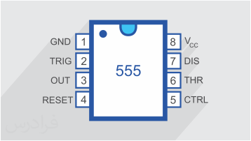
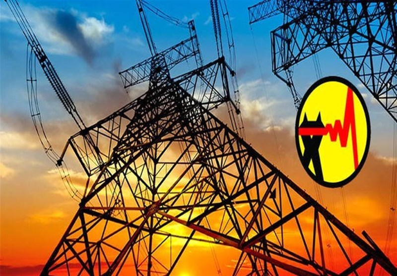

.. class:: main-head

همه چیز درباره ی برق

########################################################################

.. class:: imagelogo

لینک_مراجع_دیتاشیت_

---------

.. _لینک_مراجع_دیتاشیت : ./datasheet.html

---------

.. class:: graphics

* نمونه های الکترونیکی
  
======================================================================

.. class:: my-design-table

+------------+---------------+
| CPU        | Type          |
+============+===============+
| MSI        | Out of order  |
+------------+---------------+
| Intel      | Fast          |
+------------+---------------+
| Intel2     | Very fast     |
+------------+---------------+

-----------

* معرفی رشته ی برق  

رشته برق، رشته‌ای است که نیازمند پایه ریاضیات قوی است. همچنین در کتب فیزیک بعضی از دوره‌های تحصیلی، دروسی از رشته برق توسط معلمان تدریس می‌شود. به همین منظور بهتر است که دانش‌آموزان دروس ریاضی و فیزیک (قسمت‌هایی که مربوط به رشته برق است) را جدی گرفته و تمام مطالبی را که در این دروس به آن‌ها آموزش داده می‌شود را به خوبی فرا گیرند. همچنین بهتر است آزمایش‌های فیزیک که مربوط به قسمت برق است را به خوبی انجام دهند تا با قسمت عملی این رشته نیز آشنایی داشته باشند و پایه خودشان را در این زمینه نیز محکم کنند.

----------

* زیرگروه های این رشته

#. الکترونیک
#. کنترل
#. مخابرات
#. قدرت

--------------

* مرکز برق استان  
 

.. class:: my-info-table

-------------

* اطلاعات تماس 

 تلفن: 09981590747

